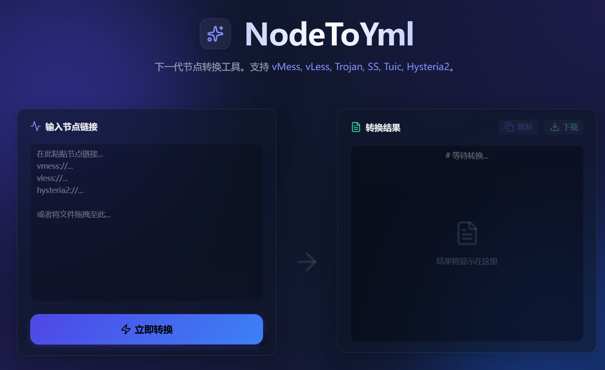

# NodeToYml

NodeToYml 是一个现代化的 Web 应用程序，旨在将各种代理节点配置转换为兼容 Clash Verge 的 YAML 文件。它拥有基于 Vue 3 和 Naive UI 构建的流畅、用户友好的界面。


## 功能特性

- **多协议支持**：无缝解析和转换以下协议的链接：
  - VMess (`vmess://`)
  - VLESS (`vless://`)
  - Trojan (`trojan://`)
  - Shadowsocks (`ss://`)
  - TUIC (`tuic://`)
  - Hysteria2 (`hysteria2://`, `hy2://`)
- **兼容 Clash Verge**：生成可直接用于 Clash Verge 的标准 YAML 配置。
- **智能去重**：自动检测并处理重复的节点名称，防止配置冲突。
- **现代化 UI**：使用 Naive UI 和 Lucide 图标设计的简洁响应式界面。
- **本地处理**：所有解析和转换逻辑均在浏览器本地运行，确保隐私和速度。

## 技术栈

- [Vue 3](https://vuejs.org/) - 渐进式 JavaScript 框架
- [Vite](https://vitejs.dev/) - 下一代前端构建工具
- [Naive UI](https://www.naiveui.com/) - Vue 3 组件库
- [js-yaml](https://github.com/nodeca/js-yaml) - YAML 解析器和生成器
- [Lucide Vue Next](https://lucide.dev/) - 美观一致的图标库

## 快速开始

### 先决条件

- Node.js (建议版本 16.0 或更高)
- npm 或 yarn

### 安装

1. 克隆仓库：

   ```bash
   git clone <repository-url>
   cd NodeToYml
   ```

2. 安装依赖：
   ```bash
   npm install
   ```

### 开发

启动开发服务器：

```bash
npm run dev
```

打开浏览器访问 `http://localhost:5173`（或终端中显示的 URL）。

### 构建

构建生产版本：

```bash
npm run build
```

构建产物将存储在 `dist/` 目录中。

## 使用指南

1. **输入链接**：将您的代理节点链接（每行一个）粘贴到输入区域。
2. **转换**：点击转换按钮处理链接。
3. **获取结果**：应用程序将生成兼容 Clash 的 YAML 配置。您可以将其复制到剪贴板或下载为文件。

## 许可证

[MIT](LICENSE)
